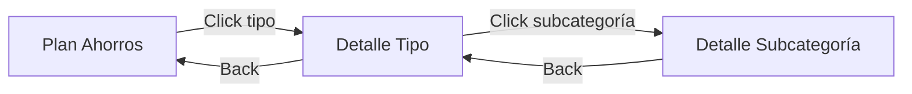

# Design: Gastos Management

## Overview

Sistema de 3 niveles para gestión de gastos:
1. **Resumen** - Vista en plan-ahorros con 4 tipos de gastos
2. **Detalle de Tipo** - Vista con subcategorías y gráficos
3. **Detalle de Subcategoría** - Lista de operaciones individuales

## Architecture

```
features/plan-ahorros/
├── pages/
│   ├── plan-ahorros-page/          # Nivel 1: Resumen
│   ├── detalle-gastos-page/        # Nivel 2: Detalle de tipo
│   └── detalle-subcategoria-page/  # Nivel 3: Operaciones
├── components/
│   ├── gastos-section/             # Sección de gastos en resumen
│   ├── gasto-tipo-card/            # Card de tipo de gasto
│   ├── subcategoria-card/          # Card de subcategoría
│   └── operacion-item/             # Item de operación
├── services/
│   └── gastos.service.ts           # Lógica de negocio de gastos
└── models/
    ├── gasto.model.ts
    └── subcategoria.model.ts
```

## Components and Interfaces

### GastosService

```typescript
@Injectable({ providedIn: 'root' })
export class GastosService {
  constructor(
    private apiService: PlanAhorrosApiService,
    private store: PlanAhorrosStore
  ) {}
  
  // Obtener resumen de gastos por tipo
  getResumenGastos(mes: string): Observable<ResumenGastosPorTipo> {
    return this.apiService.getOperaciones(mes).pipe(
      map(ops => this.calcularResumenGastos(ops))
    );
  }
  
  // Obtener detalle de un tipo de gasto
  getDetalleGastosPorTipo(
    mes: string, 
    tipo: TipoGasto
  ): Observable<TipoGastoDetalle> {
    return this.apiService.getOperaciones(mes).pipe(
      map(ops => this.agruparPorSubcategoria(ops, tipo))
    );
  }
  
  // Obtener operaciones de una subcategoría
  getOperacionesPorSubcategoria(
    mes: string,
    tipo: TipoGasto,
    subcategoria: string
  ): Observable<OperacionFinanciera[]> {
    return this.apiService.getOperaciones(mes).pipe(
      map(ops => this.filtrarPorSubcategoria(ops, tipo, subcategoria))
    );
  }
}
```

### Data Models

```typescript
export type TipoGasto = 'automaticos' | 'hormigas' | 'medios' | 'excepcionales';

export interface ResumenGastosPorTipo {
  cobrosAutomaticos: DetalleConsumo;
  gastosHormiga: DetalleConsumo;
  gastosMedios: DetalleConsumo;
  gastosExcepcionales: DetalleConsumo;
}

export interface DetalleConsumo {
  consumoDebito: number;
  consumoTC: number;
  total: number;
  topeMensual: number | null;
  porcentajeUsado: number;
  estadoAlerta: 'normal' | 'warning' | 'danger';
}

export interface TipoGastoDetalle {
  tipo: TipoGasto;
  titulo: string;
  totalMonto: number;
  totalPorcentaje: number;
  subcategorias: SubcategoriaGastoDetalle[];
}

export interface SubcategoriaGastoDetalle {
  nombre: string;
  monto: number;
  porcentaje: number;
  color: string;
  icono: string;
  operaciones: OperacionFinanciera[];
}
```

## Navigation Flow



## UI Components

### GastoTipoCard (Nivel 1)

```html
<div class="gasto-tipo-card">
  <div class="header">
    <h4>{{ titulo }}</h4>
    <span class="monto">{{ total | currency }}</span>
  </div>
  <div class="content">
    <div class="desglose">
      <span>Débito {{ consumoDebito | currency }}</span>
      <span>TC {{ consumoTC | currency }}</span>
    </div>
    <p class="disponible" [class]="estadoClass">
      Disponible: {{ disponible | currency }}
    </p>
  </div>
  <button class="btn-ver-detalle" (click)="verDetalle()">
    Ver detalle
  </button>
</div>
```

### SubcategoriaCard (Nivel 2)

```html
<div class="subcategoria-card" (click)="verOperaciones()">
  <div class="header">
    <span class="icon">{{ icono }}</span>
    <span class="nombre">{{ nombre }}</span>
    <span class="monto">{{ monto | currency }}</span>
  </div>
  <div class="progress-bar">
    <div class="fill" [style.width.%]="porcentaje" [style.background]="color"></div>
  </div>
  <div class="footer">
    <span>{{ porcentaje }}% del total</span>
    <span>{{ operaciones.length }} operaciones</span>
  </div>
</div>
```

### OperacionItem (Nivel 3)

```html
<div class="operacion-item">
  <div class="info">
    <p class="descripcion">{{ operacion.descripcion }}</p>
    <p class="fecha">{{ operacion.fecha | date }}</p>
  </div>
  <span class="monto">{{ operacion.monto | currency }}</span>
</div>
```

## Error Handling

- Si no hay operaciones: Mostrar empty state
- Si falla la carga: Mostrar error con botón de retry
- Si la navegación es inválida: Redirect a plan-ahorros

## Testing Strategy

### Unit Tests
- GastosService: Cálculos de resumen y agrupación
- Componentes: Renderizado y eventos

### Integration Tests
- Navegación drill-down completa
- Filtrado y ordenamiento de operaciones

### E2E Tests
- Flujo completo: Resumen → Tipo → Subcategoría → Operaciones
- Verificar datos mostrados correctamente
