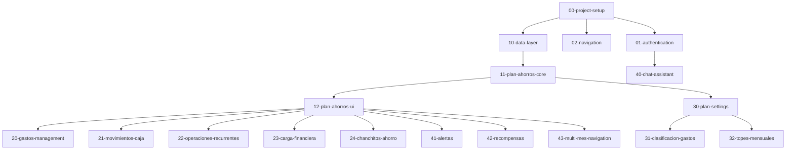

# Specs Organization Guide

## 📋 Overview

Este directorio contiene todos los specs del proyecto organizados de manera incremental. Cada spec representa una unidad de trabajo que puede ser implementada de forma independiente.

## 🎯 Naming Convention

```
[número]-[nombre-descriptivo]/
  ├── requirements.md
  ├── design.md
  └── tasks.md
```

**Número:** Indica el orden de implementación y dependencias
- `00-09`: Infraestructura y setup
- `10-19`: Core features (autenticación, navegación, etc.)
- `20-29`: Features principales (plan de ahorros, etc.)
- `30-39`: Features secundarias
- `40-49`: Optimizaciones y mejoras
- `50+`: Features futuras

## 📚 Specs Catalog

### Phase 0: Foundation (Week 1)
- ✅ `00-project-setup` - Estructura base, design system, testing setup
- 🔄 `01-authentication` - Login, registro, gestión de sesión
- 🔄 `02-navigation` - Sidebar, header, routing base

### Phase 1: Core Features (Week 2-3)
- 📝 `10-data-layer` - Servicios de API, state management, caché
- 📝 `11-plan-ahorros-core` - Modelo de datos, cálculos, validaciones
- 📝 `12-plan-ahorros-ui` - Vista principal del plan de ahorros

### Phase 2: Plan de Ahorros Features (Week 4-5)
- 📝 `20-gastos-management` - Gestión de gastos (automáticos, hormiga, medios, excepcionales)
- 📝 `21-movimientos-caja` - Gestión de movimientos de caja
- 📝 `22-operaciones-recurrentes` - Gestión de operaciones recurrentes
- 📝 `23-carga-financiera` - Visualización y gestión de carga financiera
- 📝 `24-chanchitos-ahorro` - Sistema de chanchitos de ahorro

### Phase 3: Settings & Configuration (Week 6)
- 📝 `30-plan-settings` - Configuración del plan (ingreso neto, meta ahorro, etc.)
- 📝 `31-clasificacion-gastos` - Configuración de clasificación de gastos
- 📝 `32-topes-mensuales` - Configuración de topes mensuales

### Phase 4: Additional Features (Week 7-8)
- 📝 `40-chat-assistant` - Asistente de chat
- 📝 `41-alertas` - Sistema de alertas
- 📝 `42-recompensas` - Sistema de recompensas
- 📝 `43-multi-mes-navigation` - Navegación entre meses

### Phase 5: Optimization & Polish (Week 9-10)
- 📝 `50-performance-optimization` - Optimización de rendimiento
- 📝 `51-accessibility` - Mejoras de accesibilidad
- 📝 `52-analytics` - Integración de analytics
- 📝 `53-error-handling` - Manejo robusto de errores

## 🔄 Workflow

### 1. Crear Spec
```bash
# Crear estructura de carpetas
mkdir -p .kiro/specs/[número]-[nombre]
cd .kiro/specs/[número]-[nombre]

# Crear archivos
touch requirements.md design.md tasks.md
```

### 2. Escribir Requirements
- Usar formato EARS (Easy Approach to Requirements Syntax)
- Incluir user stories con acceptance criteria
- Definir todos los términos en Glossary

### 3. Diseñar Solución
- Arquitectura y componentes
- Modelos de datos
- Diagramas (Mermaid)
- Estrategia de testing

### 4. Crear Tasks
- Tareas incrementales y pequeñas
- Cada tarea debe ser completable en < 2 horas
- Referenciar requirements específicos
- Marcar tests como opcionales con `*`

### 5. Implementar
- Ejecutar tareas en orden
- Escribir tests primero (TDD cuando sea posible)
- Hacer commits pequeños y frecuentes
- Actualizar documentación

### 6. Review & Iterate
- Code review
- Testing
- Ajustar spec si es necesario
- Documentar decisiones

## 📊 Dependencies



## 🎯 Best Practices

### DO ✅
- Mantener specs pequeños y enfocados
- Escribir requirements claros y medibles
- Incluir diagramas cuando ayuden a entender
- Referenciar requirements en tasks
- Actualizar specs cuando cambien los requerimientos
- Documentar decisiones arquitectónicas

### DON'T ❌
- Crear specs gigantes que tomen semanas
- Mezclar múltiples features en un spec
- Escribir requirements ambiguos
- Implementar sin spec aprobado
- Dejar specs desactualizados

## 📖 Templates

Ver carpeta `templates/` para plantillas de:
- requirements.md
- design.md
- tasks.md

## 🔗 Related Documentation

- [Architecture Overview](../../docs/architecture/overview.md)
- [Development Guide](../../docs/development/getting-started.md)
- [Coding Standards](../../docs/development/coding-standards.md)
